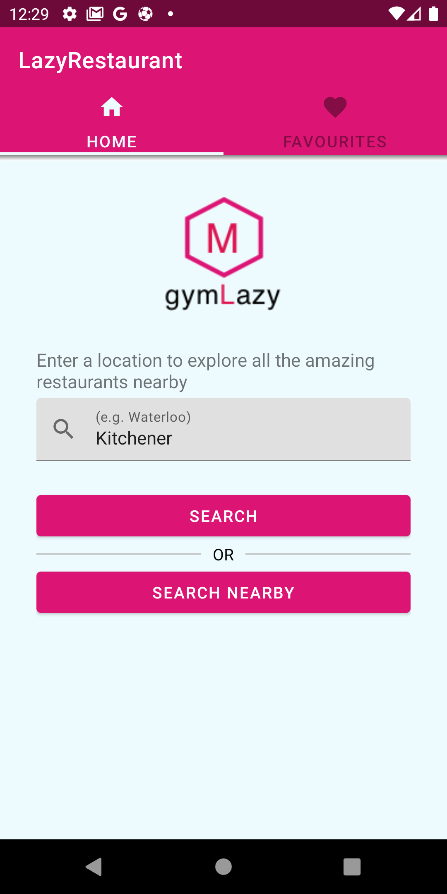
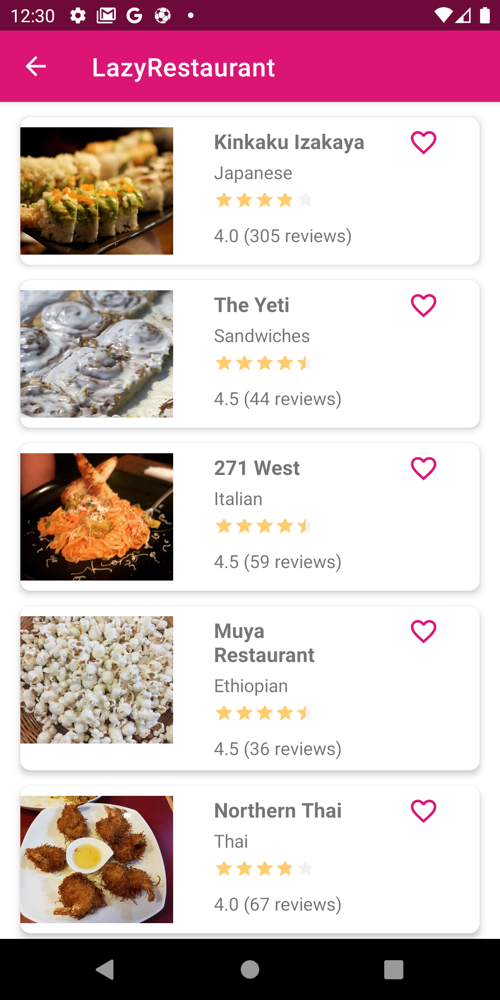
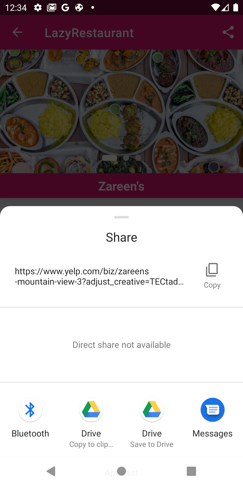
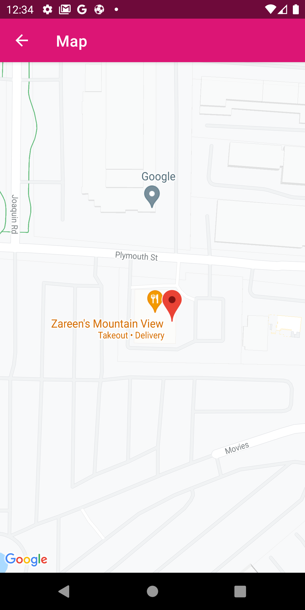

# LazyRestaurant
This is an Android app that was built for the purpose of searching restaurants based on a provided location or current location of the user.

Screenshots of the app:

    

            
            
            
        

    

         
         
          
          

